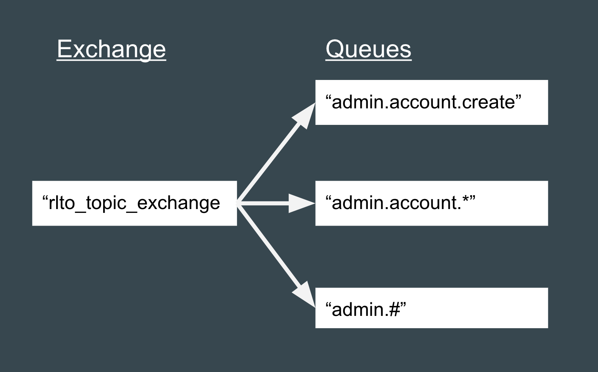

## Messaging with RabbitMQ

This is a basic example of a topic exchange with three queues bound to it. Here
is what the routing will look like:



This example assumes you have RabbitMQ running on the host '192.168.99.100',
using a fancy docker command:

```shell
docker run \
  -d --hostname my-rabbit \
  --name some-rabbit \
  -p 15672:15672 \
  -p 5672:5672 \
  rabbitmq:3-management
```

Otherwise, change the string '192.168.99.100' to the host of your rabbit
(localhost?)

#### Starting up the consumers
In all different windows:
```shell
ruby receive_topic_message.rb "admin.account.create"
ruby receive_topic_message.rb "admin.account.*"
ruby receive_topic_message.rb "admin.#"
```

#### Publishing
In another window:
```shell
ruby send_topic_message.rb "admin.account.create"
ruby send_topic_message.rb "admin.account.update"
ruby send_topic_message.rb "admin.account.delete"
ruby send_topic_message.rb "admin.name.update"
ruby send_topic_message.rb "admin.move"
```

Messages will appear in the consumer windows based on the routing keys
